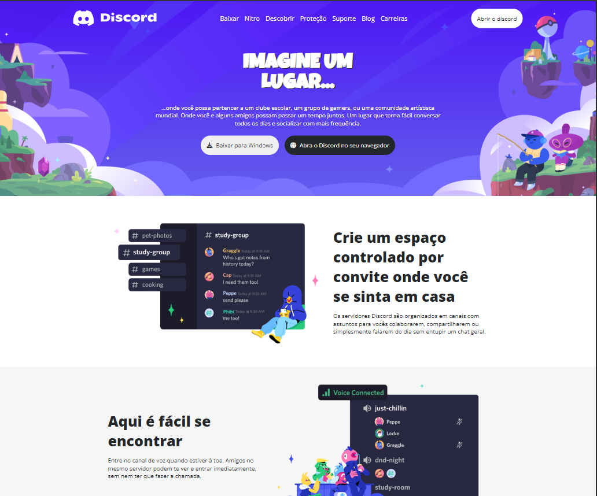
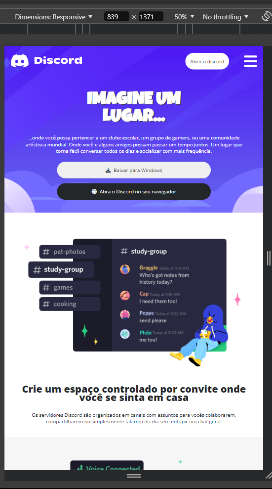
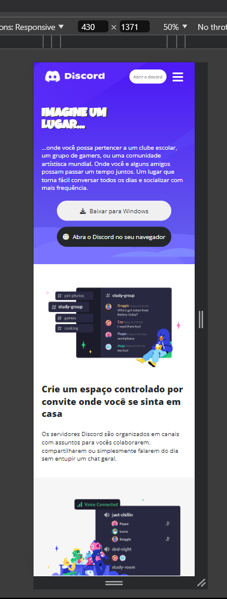

# Trilha CSS Dio Desafio 004

## Desafio 004 Reproduzir o site do discord de forma responsiva

**O projeto foi baseado no [**Figma**](https://www.figma.com/design/NRBYrG5d4DSzObv7dpTqoM/Desafio-Responsividade---DIO?node-id=1-2&t=av7YmpOxTuk5ikZd-0), que por sinal foi um desafio a mais por ter em seu layout principal seções de tamanhos e direções diferentes, mas no fim deu certo, procurei respeitar todos os espaçamentos propostos pelo Figma.
**Como toque pessoal adaptei de forma responsiva uma barra de navegação no header semelhante a do site oficial do discord, no figma pede que o layout seja adaptado para celular, mas fiz questão de deixar o layout bem adaptado para tablets testanto medida por medida, usei o meu conhecimento de outros projetos e procurei dar uma pequena interação aos botões como uma leve transição, um pequeno sombreamento na tag principal e importei ícones do [**fontawesome**](https://fontawesome.com/) para usar nos botões.
**Sobre o HTML procurei deixar ele bem semântico, fazendo o uso adequado das tags semânticas.
**Em Relação ao CSS, fiz o uso de variáveis, revisei o código várias vezes com o intuito de evitar repetição de propriedades e seletores,usei em todo o projeto unidades de medida relativas, fiz o uso tanto do display flex quanto do grid para deixar o layout o mais universal que consegui.

## Ferramentas usadas

**Copilot para:
-Para sugestão de nome de classes e variáveis.
-Descrever o alt das imagens das seções.

**DevTools:
-Foi fundamental para atingir o objetivo de deixar o projeto responsivo,testei muitas propriedades, até reescrevi o código várias vezes até atingir o objetivo final, bem dizer passei a maior parte do projeto usando o DevTools.

## Projeto Finalizado

## Conclusão

**Projeto bem desafiador pois foi a primeira vez que fiz um projeto com o layot responsivo, tenho conciência da extrema importância da responsividade nos projetos, afinal de contas todos que acessam nossas aplicações por diferentes tipos de tela, almejando ser um bom programador quero proporcionar a melhor experiência possível aos usuários que acessarem minhas aplicações , e atender a essa demanda com excelência requer uma atenção especial no quesito da responsividade, por conta disso dediquei horas revisando código, lendo documentações, assistindo aulas, e no final atingir o resultado esperado é muito gratificante, usarei todo o conhecimento que obtive com esse desafio para próximos desafios e projetos, ainda tenho muito a melhorar e aprender a cada dia.
